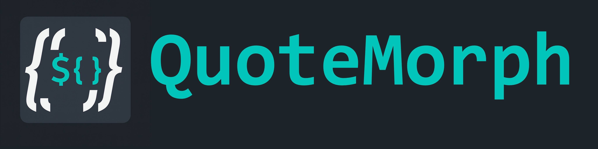
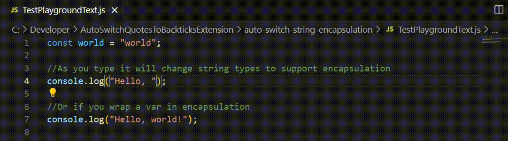

    


# QuoteMorph

This extension, **QuoteMorph**, automatically converts single or double-quoted strings to backticks in your code when template literals are detected. It is designed to enhance your coding experience by seamlessly switching string encapsulation, especially when working with template literals.

## Features

- Automatically detects when `${}` or `{}` is typed within a string and converts the surrounding quotes to backticks.
- Works in real-time as you type, ensuring a smooth and efficient workflow.
- Supports both single (`'`) and double (`"`) quotes.

### Example


Before typing `${}`:
```typescript
const message = "Hello, world!";
```

After typing `${}`:
```typescript
const message = `Hello, ${name}!`;
```

## Requirements

This extension does not have any special requirements or dependencies. It works out of the box with Visual Studio Code.

## Extension Settings


All settings are under the `quoteMorph` namespace.

- `quoteMorph.enabled` (boolean, default: `true`)  
    Enable or disable the extension.

- `quoteMorph.languageIds` (string[], default: `["javascript","typescript","javascriptreact","typescriptreact","vue","svelte","astro"]`)  
    List of language IDs where the extension should run when `quoteMorph.enableForAllLanguages` is `false`.

- `quoteMorph.enableForAllLanguages` (boolean, default: `false`)  
    If `true`, the extension runs for any language and ignores `quoteMorph.languageIds`.

- `quoteMorph.enableQuotesSingle` (boolean, default: `true`)  
    When `true`, converts single-quoted strings (`'...'`) to backticks (`` `...` ``) if `${}` interpolation is used.

- `quoteMorph.enableQuotesDouble` (boolean, default: `true`)  
    When `true`, converts double-quoted strings (`"..."`) to backticks (`` `...` ``) if `${}` interpolation is used.

## Known Issues

- The extension currently only supports single-line strings. Multi-line strings are not yet handled.
- If there are nested quotes or complex string structures, the behavior might be unpredictable.

## Release Notes

### 1.1.8
- Fix issue where quotes within encapsulated strings get morphed

### 1.1.7
- Ignore escaped quotes

### 1.1.2 - 1.1.6
- Attempts to fix CI/CD for NPM

### 1.1.1
- Fixed CI/CD

### 1.1.0
- Fixed 
  - issues with quotes not morphing
  - issues with vue template bindings trigging morph
- Added configuration (settings) 
  - to enable / disable 
  - active file types
  - disable triggering on certain quotes (e.g. only enable for single quotes)
- Developer Experience 
  - Added unit tests

### 1.0.4

- Fixed issues with bleed thru where if you typed the right sequence across lines / editors the quote changes would be made in an inappropriate place+

### 1.0.3

- Add vue file support
- Fixed issues with vue / html attributes encapsulating the double quotes when it shouldn't be

### 1.0.2

- Fixed issue with pipeline

### 1.0.1

- Updated documentation
- Added icon
- Added banner
- Fixed workflows

### 1.0.0

- Initial release of **QuoteMorph**.
- Added support for detecting `${}` and `{}` within strings and converting quotes to backticks.

---

## Following Extension Guidelines

This extension adheres to the [Visual Studio Code Extension Guidelines](https://code.visualstudio.com/api/references/extension-guidelines) to ensure best practices and a high-quality user experience.

## Please also consider supporting me on ko-fi
https://ko-fi.com/marcellobachechi

<a href='https://ko-fi.com/marcellobachechi' target='_blank'>


**Enjoy coding with QuoteMorph!**
